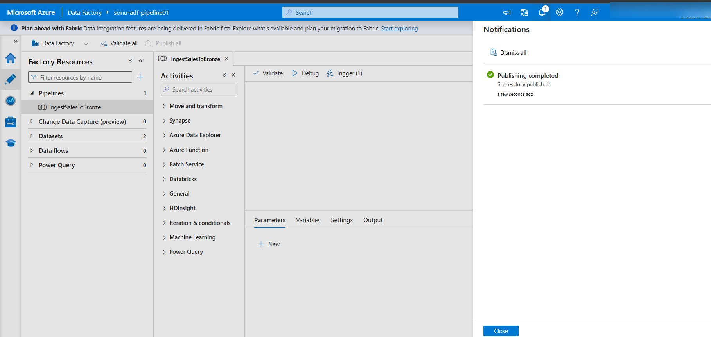
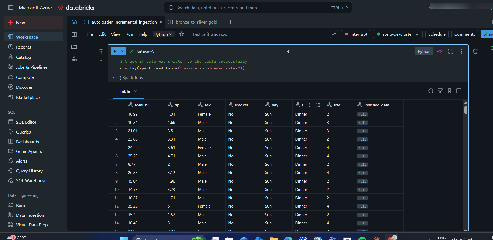
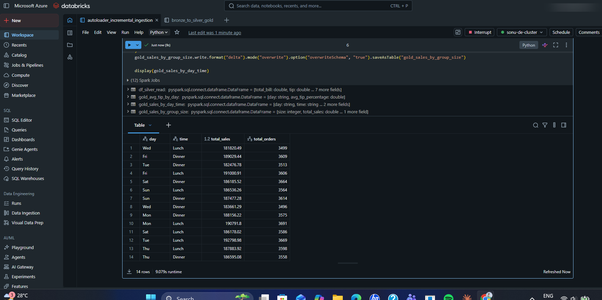
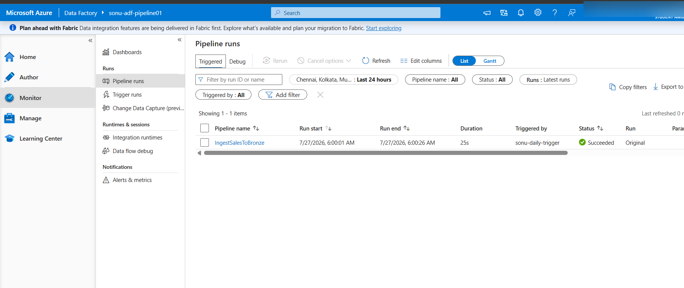

# azure-databricks-incremental-pipeline

## Azure Data Pipeline — Scheduled Orchestration & Incremental Ingestion

An extension of my Bronze → Silver → Gold data pipeline on Azure, adding two production-style capabilities: **automated scheduling** (Azure Data Factory) and **incremental file ingestion** (Databricks Auto Loader).

## What this project does

- Runs an Azure Data Factory pipeline automatically every day via a **Schedule Trigger** — no manual execution needed.
- Uses **Databricks Auto Loader** (`cloudFiles`) to incrementally ingest new files from Azure Blob Storage into a Bronze Delta table, without reprocessing files that were already ingested.
- Cleans and standardizes the data in a **Silver** layer (type casting, deduplication, fixing inconsistent values).
- Produces three **Gold** layer aggregate tables, ready for BI/dashboard consumption.
- Verified with a real incremental test (a 50,000-row file dropped into storage was picked up automatically) and a live scheduling test (the pipeline fired on its own at 6:00 AM the next day).

## Architecture

```
Azure Blob Storage (bronze/silver/gold containers)
        │
        ▼
Azure Data Factory  ──▶  Scheduled Trigger (daily, 06:00 IST)
        │
        ▼
Databricks Auto Loader (cloudFiles) ──▶ Bronze Delta table (incremental)
        │
        ▼
Silver layer (cleaned, standardized, tip_percentage added)
        │
        ▼
Gold layer (3 aggregate tables):
  - sales_by_day_time
  - avg_tip_by_day
  - sales_by_group_size
```

## Tech stack

- **Azure Data Factory** — pipeline orchestration and scheduling (Schedule Trigger)
- **Azure Databricks** — Auto Loader (incremental ingestion), PySpark transformations
- **Delta Lake** — storage format for Bronze/Silver/Gold tables
- **Azure Blob Storage (ADLS Gen2)** — data lake storage, separate containers per layer

## Key implementation details

### 1. Scheduled trigger (Azure Data Factory)
A daily Schedule Trigger (`sonu-daily-trigger`) was added to the existing ingestion pipeline, configured for 06:00 AM IST, and published. Verified the next day: the pipeline fired automatically at 6:00:01 AM and completed successfully in 25 seconds — no manual intervention.

### 2. Incremental ingestion (Databricks Auto Loader)
```python
df = (spark.readStream
      .format("cloudFiles")
      .option("cloudFiles.format", "csv")
      .option("cloudFiles.schemaLocation", checkpoint_path)
      .option("header", "true")
      .load(bronze_source_path))
```
Auto Loader tracks which files have already been processed via a checkpoint location, so only new files are picked up on each run — tested by dropping a 50,000-row file into storage and confirming it was ingested automatically.

### 3. Data cleaning and standardization (Silver layer)
Caught and fixed a data inconsistency where "Thu" and "Thursday" entries were recorded as both `"Thu"` and `"Thur"`, silently splitting aggregated results across two rows. Standardized during the Silver transformation step.

Full notebook (with outputs): [`autoloader_incremental_ingestion.ipynb`](./autoloader_incremental_ingestion.ipynb)

## Challenges faced

| Issue | Cause | Fix |
|---|---|---|
| `KeyProviderException` / invalid `fs.azure.account.key` | New notebook did not inherit storage credentials from the original notebook | Explicitly set `spark.conf.set(...)` with the storage account key (in production: Databricks Secrets / Key Vault) |
| `AnalysisException`: schema mismatch on Delta write | Added a new column (`tip_percentage`) to a table with an existing, different schema | Used `.option("overwriteSchema", "true")` on write |
| Aggregates showing duplicate day categories | Inconsistent raw values (`"Thu"` vs `"Thur"`) treated as distinct groups | Standardized values in the Silver transformation using `when()` / `otherwise()` |

## Screenshots

**1. Azure Data Factory — Schedule Trigger published successfully**


**2. Auto Loader detecting and processing a 50,000-row file automatically**


**3. Final Gold layer table — 14 clean rows after fixing the Thu/Thur inconsistency**


**4. Trigger run history confirming the pipeline fired automatically at 6:00 AM the next day**


---
**Author:** Sonu Kushwaha
